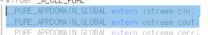
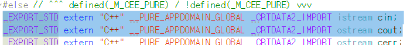

# 실습과제 1
## 전처리 또는 선행처리 단계를 설명하라
* 컴파일되기 전에 소스 코드를 변환하는 단계를 전처리라고 한다. 전처리기(Preprocessor)가 이 작업을 담당하며, '#' 기호로 시작하는 지시어를 처리한다. [ex) #include, #define, #ifdef 등]

## 객체 cin,cout은 어디에 선언되어 있는가?선언된 파일을 찾아서 의미를 설명하고 캡쳐하여 첨부하라 ->교재 75페이지 2.5절 내용을 참고할 것


* <iostream> 헤더에 선언되어 있다.

## 프로그램을 링크할때 이름 충돌이 발생하는 경우를 설명해보라
* 전역 변수 또는 함수의 중복 정의로 인하여 발생하는 경우가 잦으며, 서로 다른 라이브러리 간의 같은 이름의 함수를 호출할 때에도 발생한다. 또한, 네임스페이스 없이 작성한 경우에 라이브러리 혼용으로 인한 충돌도 발생할 수 있다.

## 스트림이란 무엇인가?
* 데이터가 통하는 통로의 개념이다. 출력 스트림은 데이터가 출력되는 통로, 입력 스트림은 데이터가 입력되는 통로로, 코딩의 표준이 되는 대표적 예시 중 하나이다.

## 표준 출력 스트림을 정의할 때 사용하는 C언어 자료형은?
* FILE * (FILE 구조체 포인터), <stdio.h>안에 포함되어 있고, fprintf() 함수로 출력한다.

## 표준 출력 스트림을 정의할 때 사용하는 C++언어 자료형은?
* std::ostream(클래스(참조)), <iostream>안에 포함되어 있고, << 연산자로 출력한다.

# 실습과제 2
```
int main()
```
* 메인 함수 시작
```
	cout << "이름 : 임성배\n" << "주소 : 군산시 대학로 558\n" << "학번 : 201012\n" << "차종 : 벤츠";
```
* 출력 문장 작성('<<'연산자를 연속으로 활용하여 출력할 내용을 이어서 작성할 수 있다.
```
	cout << endl;
```
* 마지막 줄 띄우기

# 실습과제 3
```
cout << "군산대학교 \"임성배\"\n" << "\"축하합니다.\"\n" << "100\% \\취업율\\\n";
```
* 출력하고자 하는 특수문자 앞에 '\(역슬래시)'를 삽입하는 것으로 출력이 가능하다. [예시 : '\"', '\\', '\%']

# 실습과제 4
```
int n = 7;
```
* 크기 변수 n 정의 (홀수로 해야 가운데의 '*'이 교차할 수 있음)
```
for (int i = 0; i < n; i++) {
    for (int j = 0; j < n; j++) {
        if (i == j || i + j == n - 1)
```
* i와 j가 좌표 역할을 해주며, i와 j가 같으면 왼쪽 위 >> 오른쪽 아래 방향 대각선을,  i + j == n - 1일 경우에는 오른쪽 위 >> 왼쪽 아래 방향 대각선을 지난다.
```
            cout << "* ";
```
* 각 위치에 '*'을 그린다.
```
        else
            cout << "  ";
    }
```
* 대각선이 아닌 공간은 빈 공간으로 fill
```
    cout << "\n";
}
```
* n까지의 순환이 끝나면 줄 띄우기
```
return 0;
```
* 코드 종료

# 실습과제 5
```
	for (int i = 0; i < 4; i++) {
		for (int j = 0; j < 4; j++) {
			if (i >= j)	cout << "*";
```
* 최대 4개까지의 '*'을 그리도록 하였다.
* i의 내부에서 j를 순환시키며, i보다 작거나 같은 경우까지 '*'을 반복해서 그린다.
```
cout << "\n";
```
* 줄 띄우기
```
return 0;
```
* 코드 종료
